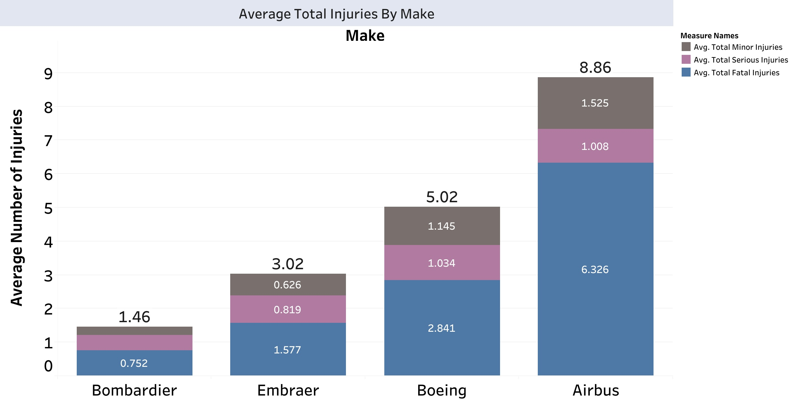
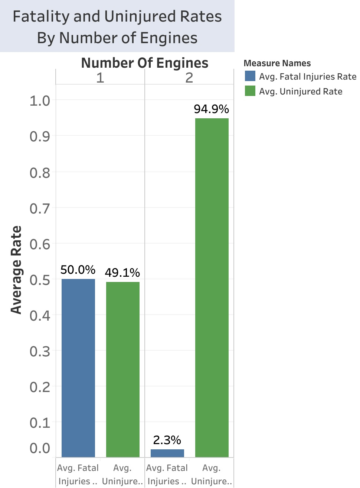
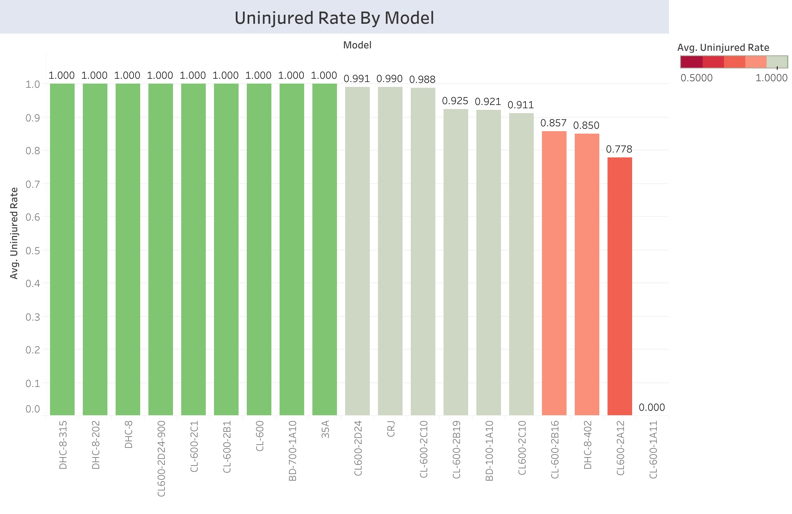

<center></center>

# Aviation Industry Expansion
Author: [Scarlett Valentin](https://www.linkedin.com/in/scarlett-valentin/)

# Business Understanding
Our company is *expanding* by **purchasing and operating airplanes** for commercial and private enterprises. In this analysis, I determine which aircraft are the **lowest risk** for the company to start this new business endeavor. I use the fatal injuries rate, uninjured rate, and total number of injuries as meaures of safety and investigate the effect the make of the aircraft, the number of engines, and the model have on these safety parameters.

I investigate the following three business questions:
1. What is the safest aircraft **make**?
2. What is the safest **number of engines** for an aircraft?
3. What is the safest aircraft **model**?

# Data Understanding

<center></center>

The [Aviation Accident Database & Synopses, up to 2023](https://www.kaggle.com/datasets/khsamaha/aviation-accident-database-synopses/data) from the NTSB (National Transportation Safety Board) aviation accident database contains information about ​**civil aviation accidents and selected incidents** that occurred between 1962 and 2023 within the United States, its territories and possessions, and in international waters. From this database, I analyze the numbers of injuries, the make of the aircrafts, the number of engines on the aircrafts, and the model of the aircrafts to determine our first step in the expansion of the aviation industry.

## Data Preparation
The dataset has approximately 89,000 accidents and incidents. All but 4 columns have varying numbers of null values. There are over 12,000 unique models and over 8,000 unique makes. These will have to be greatly narrowed down to determine a recommended make and model.

## Data Cleaning
Before beginning any type of analysis, I must clean the dataset. 

1. I check for **duplicates** (there are none).
2. I **drop columns** that will not be useful to my analysis.
3. I standardize the **column names**, **make names** and select **model names**. 
4. I **create 3 more columns** that will be useful during the analysis: Total_Passengers, Fatal_Injuries_Rate, Uninjured_Rate.
5. I **drop na's** from columns that include number or rates of injuries, fatalities or uninjured because without those numbers, I will not be able to determine safety.

# Exploratory Data Analysis
### *Make* Analysis
I began with comparing the top 4 aircraft makes with the **average number of injuries** per accident. Bombardier has the *least* average number of injuries and the *least* average number of fatal injuries. Airbus has the *highest* average number of total injuries and the *highest* average numbers of fatal injuries.



### Number of Engines Analysis
Aircrafts with **3 engines** hold both the *highest* uninjured rate and the *lowest* fatality rate, followed by aircrafts with 2 engines, aircrafts with 4 engines, aircafts with 1 engine, and lastly, aircrafts with 0 engines. Aircrafts with 0 engines (gliders) have the *lowest* uninjured rate and the *highest* fatality rate. Bombardier only has 1-engine and 2-engine aicrafts, and their 2-engine aircrafts are overwhelmingly safer than their 1-engine aircrafts.



### *Model* Analysis
The aircrafts have been narrowed down to Bombardier 2-engine aircrafts. Upon the *model* analysis, I first narrowed down to 9 models that had a 100% uninjured rate. Then I determined the most popular aircraft model by counting how many entries each of the models had in the data. The **CL-600** had the *highest count*. Although this dataset does not have a record of all flights, I am assuming the CL-600 has the highest number of occurences due to its popularity. This assumption is supported by the fact that the Bombardier 2-engine aircrafts are proven to be safe, and all accidents with this model have a 100% uninjured rate.



# Conclusion

## Limitations
There are various limitations in this analysis.

1. I could not compute the **proportion of accidents to total number of flights**, as this data includes only records of accidents or incidents. This data does not include clean records of flights with no accidents or incidents. When recommending an aircraft company, aircraft model, or location of operation, I used the basis of which has the lowest number of accidents/incidents, with zero accidents/incidents not being an option.

2. I chose a specific **aircraft model** out of a list of the 9 safest models based on the number of occurrences in the data under the assumption that more occurrences equates to higher popularity of an aircraft. Alternatively, more occurrences can indicate an aircraft that has a high accident ratio. This would have to be calculated using a dataset of *all* flights, not just those with accidents (as mentioned above). However, a better interpretation is that more accidents are due to more total flights. This is likely because the list of 9 aircrafts have already been determined to be the safest out of the dataset.

## Recommendations
This analysis has led me to conclude the following three recommendations: 
1. **Bombardier** is the aircraft manufacturer that I suggest we purchase. Bombardier has overall the *least* average number of injuries and the *highest* uninjured rate when compared to Airbus, Boeing and Embraer.

2. I recommend we purchase a Bombardier aircraft with **2 engines**. Bombardier aircrafts only come with 1 or 2 engines. According to the data, 2-engine aircrafts have a *lower* fatality rate and a *higher* uninjured rate that 1-engine aircrafts.

3. The aircraft model of our first purchase should be a **CL-600**. This model is among Bombardier's safest 2-engine aircraft. It is a popular model, as it has the highest count among those safest aircrafts.

## Next Steps
In order to optimize ***profits*** for this new industry expansion, we must analyze the financial aspects by answering the following three questions: 

1. What **flight schedule** will provide the greatest profit? Consider seasonal, weekly, and daily schedules. 

2. **How many aircrafts** should we initially purchase? Consider *cost* of aircraft and operation of such aircraft.

3. What **location** should we operate out of? Let's plan to narrow this down further. Consider chances of interrupted flights due to *weather*.

# For More Information
See the full analysis in the [Jupyter Notebook](/notebook.ipynb/), review this [presentation](/presentation.pdf/), or review the [interactive dashboard](https://public.tableau.com/app/profile/scarlett.valentin/viz/Aviation_Expansion_Dashboard/AverageTotalInjuriesByMake?publish=yes)


# Repository Structure


```

├── images
├── README.md
├── presentation.pdf
└── notebook.ipynb
```
